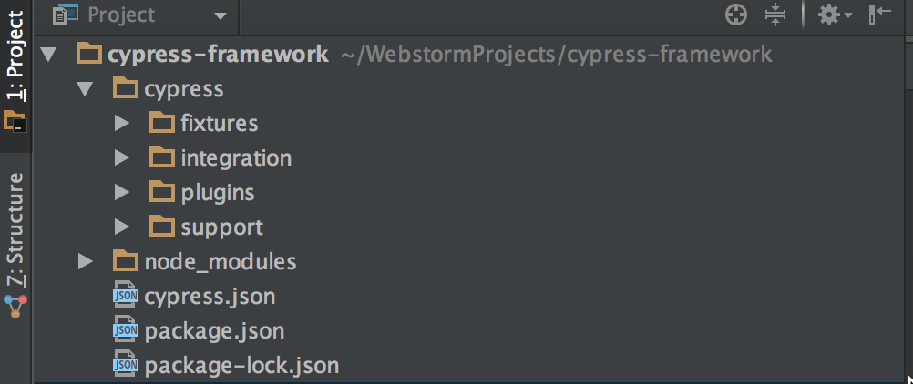

# Overview of Cypress

## Page Object Model
Cypress does not recommend using the Page Object Model pattern that most folk will be used to from the Selenium based
frameworks (see the article by Martin Fowler [Page Object](https://martinfowler.com/bliki/PageObject.html) ) the 
preferred option is to use the Cypress Custom Commands, this POM version has been added to provide a comparison.


# Installing Cypress from Scratch
Create a project directory
Open a Terminal in the project root directory

`$ npm init`

`$ npm install cypress --save-dev`

Further details see [Cypressio npm install](https://docs.cypress.io/guides/getting-started/installing-cypress.html#npm-install)

## Opening Cypress 

You can now open the Cypress console by running:

`$ node_modules/.bin/cypress open`

or

`$ npx cypress open`

from the project root folder.

This will also generate the following scaffold directory structure 



To run from  a command line add a Script to the Package JSON file

`cyrun": "node_modules/.bin/cypress run --browser chrome"`

Tests can then be run from a Terminal

`$ npm run cyrun`


## Plugins

### Cucumber

`$ npm install cypress-cucumber-preprocessor --save-dev`

Now configure Cypress by adding the [Cucumber Plugin](https://github.com/TheBrainFamily/cypress-cucumber-preprocessor) 
to the cypress/plugins/index.js file:

```
const cucumber = require('cypress-cucumber-preprocessor').default

module.exports = (on, config) => {
  on('file:preprocessor', cucumber())
}
```

and add support for feature files to your Cypress configuration file cypress.json which was generated 
when Cypress was initially opened as part of the scaffold structure:

`
{
"testFiles": "**/*.feature"
}`


The Cypress-Cucumber-Preprocessor docs recommend using the [Cosmic Config module](https://github.com/davidtheclark/cosmiconfig) installed via:

`$ npm install cosmiconfig --save-dev`

and then added as a section to the package.json file as follows:

`"cypress-cucumber-preprocessor": {
   "nonGlobalStepDefinitions": true
 }`
 
 By setting this to true, the Cypress Cucumber Preprocessor Style pattern for placing step definitions files will be
 used instead of the "oldschool" i.e. everything is global Cucumber style.
 
 Environment variables can be added via a cypress.env.json file and accessed
 within the code so
 
 `Cypress.env('keyValue')`
